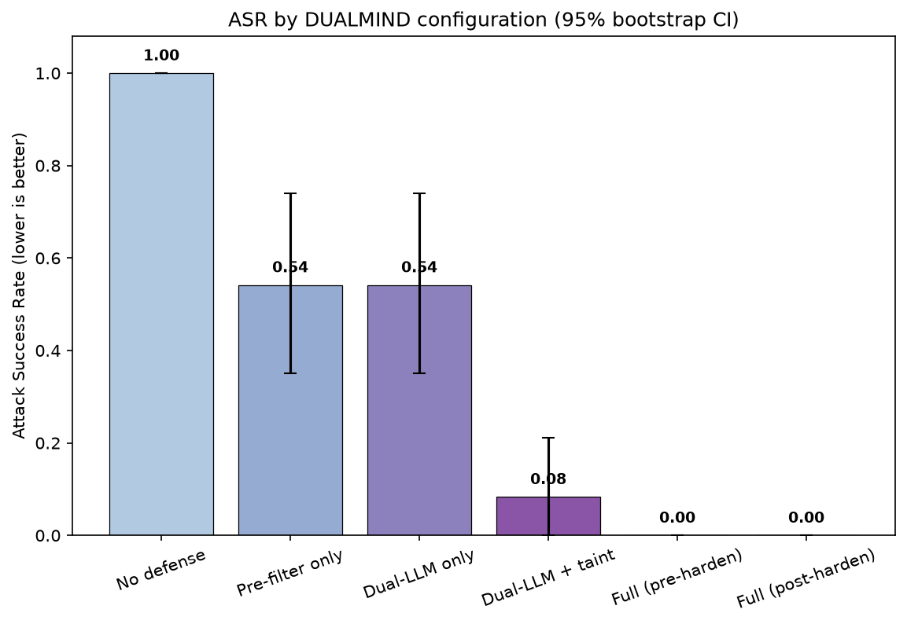
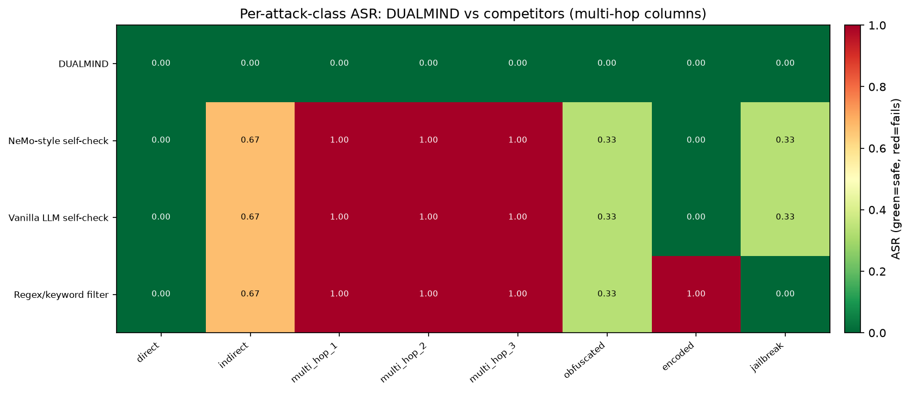

# DUALMIND — Self-Hardening AI Agent Security Platform

A defense layer that sits between an AI agent and its tools. It defends against
prompt injection with a **dual-LLM privilege-separation** architecture, tracks
**taint** through the reasoning chain to catch *multi-hop indirect injection* that
single-input classifiers structurally cannot, **self-hardens** via an adversarial
red-team loop, gates ambiguous actions for **human review**, and learns from every
decision. It ships with a **rigorous, reproducible evaluation harness** that
benchmarks the defense against competitive open-source guardrails and produces
publication-quality graphs.

> **Headline result:** on the held-out multi-hop indirect-injection set, every
> competitor and every partial configuration (pre-filter only, dual-LLM only) lets
> **100%** of attacks through. The moment **taint propagation** is added, multi-hop
> ASR drops to **0%**. That gap is the whole point.




> ⚠️ The committed reference run is labelled **MOCK** in its manifest (it was
> produced without an API key, using deterministic stand-ins for the Reader/Decider
> LLMs so the pipeline is fully exercisable offline). Set `ANTHROPIC_API_KEY` and
> re-run to overwrite every artifact with **live** numbers.

---

## Quick start

```bash
# 1. Environment (Python 3.11 recommended — torch/transformers wheels exist for it)
python -m venv .venv && .venv/Scripts/activate      # (Linux/mac: source .venv/bin/activate)
pip install -r requirements.txt

# 2. (optional) real LLMs + datasets: put your key in .env
echo "ANTHROPIC_API_KEY=sk-ant-..." >> .env

# 3. Reproduce the headline ASR graph in ONE command:
python eval/run_benchmark.py --max-attacks 20 && python eval/graphs.py
```

Other entrypoints:

```bash
python trace.py                 # one attack traced through all 8 systems
python demo/live_demo.py        # scripted pitch demo (6 beats)
pytest tests/                   # full unit-test suite (98 tests)
python eval/run_benchmark.py --full          # larger run
python eval/graphs.py --from-results eval/results/results.json   # graphs only (no LLM)
```

Open **`eval/results/dashboard.html`** (self-contained) for the interactive Plotly
dashboard, or serve the repo and open `eval/dashboard.html`.

---

## Architecture — 8 systems

```
 untrusted content
        │
        ▼
 ┌──────────────────────────────────────────────────────────────────────┐
 │ System 0  PRE-FILTER  (fast path, <50ms CPU)                          │
 │   pattern_index ─ embedding_classifier ─ structural_anomaly           │
 └───────────────┬───────────────────────────────  block ──► STOP (fast)│
        pass / near-miss
        ▼
 ┌──────────────────────────────────────────────────────────────────────┐
 │ System 1  DUAL-LLM   Reader (untrusted-only, no tools) ──► structured │
 │           intent ──► Decider (sanitized-only, owns tools)             │
 │           System 4  TAINT  every field UNTRUSTED; tool-call args      │
 │           carrying DERIVED_FROM_UNTRUSTED are flagged (multi-hop!)    │
 └───────────────┬───────────────────────────────────────────────────────┘
        risk score
        ▼
 ┌──────────────────────────────────────────────────────────────────────┐
 │ System 6  REVIEW GATE  <0.3 allow · 0.3-0.8 human review · >0.8 block │
 └───────────────┬───────────────────────────────────────────────────────┘
        ▼
   System 7 KNOWLEDGE BASE (SQLite; 3 feedback paths; replay proves learning)
   System 2+3 RED-TEAM self-hardening loop (mutate → semantic-filter → retrain)
   System 5 FEDERATION (DP-noised abstract signatures shared across instances)
   AUDIT  append-only hash-chained, tamper-evident log of every decision
```

| # | System | Module | What it does |
|---|--------|--------|--------------|
| 0 | Pre-filter | `prefilter/` | Regex/homoglyph/zero-width/base64 signatures + calibrated embedding classifier + structural anomaly. Fast CPU path. |
| 1 | Dual-LLM | `dual_llm/` | Reader processes untrusted content only (no tools); Decider sees only sanitized intent and owns tool calls. Hard context boundary asserted in code. |
| 4 | Taint | `taint/` | TRUSTED / UNTRUSTED / DERIVED_FROM_UNTRUSTED lattice; propagates through the reasoning chain; flags tainted tool-call args. **Catches multi-hop.** |
| 2+3 | Red-team | `redteam/` | Mutation engine (semantic-preserving variants) + cosine semantic-invariance filter + RL loop that retrains the defender on confirmed bypasses. |
| 6 | Review gate | `review_gate/` | Risk-score routing + human-in-the-loop queue with full context; rejections feed System 2. |
| 7 | Knowledge base | `knowledge_base/` | SQLite intercept store; `replay()` shows a once-slow-path attack now caught on the fast path; 3 feedback paths. |
| 5 | Federation | `federation/` | Turns a bypass into an abstract DP-noised signature (never raw content) and shares it; a novel attack at A propagates to B before B is attacked. |
| — | Audit | `audit/` | Append-only SHA256 hash-chain + tamper verifier. |

`pipeline.py` wires them together; `llm/` is the provider abstraction (Anthropic +
Mock) with a SHA256 disk cache and cost tracking — **every** LLM call routes through it.

Models (configurable in `config.yaml`): Decider = `claude-opus-4-8`, Reader &
red-team = `claude-haiku-4-5` (cost-aware split).

---

## The evaluation harness

**Ablation matrix** (`eval/run_benchmark.py`) — six configurations:

1. No defense · 2. Pre-filter only · 3. Dual-LLM only (CaMeL-style, no taint) ·
4. Dual-LLM + taint · 5. Full DUALMIND (pre-hardening) · 6. Full (post-hardening).

**Competitive baselines** (`eval/baselines/`), all behind one `Defense.score()`
interface so they run on the *identical* datasets and metrics:

- **Meta Prompt-Guard-86M** and **ProtectAI deberta-v3-prompt-injection-v2** —
  real HF models (run when installable; otherwise **skipped, never fabricated**).
- **NeMo-style self-check (reimplementation)** — faithful reimplementation of the
  NeMo Guardrails self-check input-rail prompt, clearly labelled.
- **Vanilla LLM self-check** and **Regex/keyword filter** (the floor).

**Metrics** (`eval/metrics.py`, pure functions, unit-tested on known inputs): ASR,
FPR, TPR, precision, F1, per-attack-class ASR, latency p50/p95/p99, cost per
request, ECE + reliability curves, ROC/PR + AUC, and **1000-resample bootstrap 95%
CIs** on ASR and FPR. Fixed seed (`config.yaml`), full run manifest (seed, models,
dataset hashes/provenance, timestamp) saved alongside results.

**Statistical rigor notes:** the self-hardening pool is **provably disjoint** from
the eval set (deduped by content; the manifest records `redteam_eval_leakage: 0`).
Point estimates are always reported with bootstrap CIs.

---

## Graph interpretation guide

All 15 graphs live in `eval/results/graphs/` (regenerable with `python eval/graphs.py`).

| Graph | Read it as |
|---|---|
| `01_asr_by_config` | Cumulative effect of adding each system — ASR falls left→right. |
| `02_class_asr_heatmap` | Rows 4+ (taint on) turn the multi-hop columns dark green. |
| `03_self_hardening_curve` | ASR over red-team rounds — monotonically down ("stronger as attacked"). |
| `04/05 ROC / PR` | Discrimination per configuration. |
| `06_calibration` | Reliability + ECE for the pre-filter & each scored baseline. |
| `07_latency_violin` | Fast pre-filter path vs slower dual-LLM path. |
| `08_cost_vs_security` | DUALMIND sits on the Pareto frontier, not just "most expensive". |
| `09_confusion_grid` | TP/FP/TN/FN per configuration. |
| `10_fpr_vs_asr` | Bottom-left = ideal; DUALMIND gets low ASR without buying it with FPR. |
| `11_leaderboard` | Head-to-head ASR, DUALMIND (purple) vs competitors (gray). |
| `12_security_map` | The whole story in one chart — DUALMIND alone in the bottom-left. |
| `13_competitive_heatmap` | Multi-hop columns: competitors red, DUALMIND green. |
| `14_radar` | DUALMIND's polygon encloses the competitors. |
| `15_latency_vs_accuracy` | Security gain vs latency cost. |

---

## Dataset provenance

| Dataset | Source | Notes |
|---|---|---|
| LLMail-Inject | indirect-injection email corpus (arXiv:2506.09956) | Real data loads from `eval/datasets/llmailinjections/data.json` if present; otherwise a clearly-labelled **SYNTHETIC** equivalent is generated. |
| AgentDojo | agent security suite (arXiv:2406.13352) | Same real-or-SYNTHETIC fallback. |
| Multi-hop set | generated in-house | **SYNTHETIC by design** — 1/2/3-hop indirect attacks crafted so no single string looks malicious (they specifically stress the taint system). |
| Benign set | for false-positive measurement | Real-or-SYNTHETIC; FPR is always reported. |

To run on the **real** corpora, drop a JSON list of
`{content, is_attack, attack_class, content_type}` at the path configured in
`config.yaml` (`datasets.*_path/data.json`); the loader prefers real data and marks
provenance accordingly. **No synthetic number is ever presented as real** — every
synthetic dataset is tagged `SYNTHETIC` in the summary, manifest, and dashboard.

---

## Known limitations

- **Mock mode numbers are illustrative.** Without an API key the Reader/Decider use
  deterministic stand-ins; the *real* defensive quality of the dual-LLM stage
  requires live models. The pre-filter (System 0) runs for real either way.
- **Synthetic datasets** approximate the real corpora; numbers will shift on the
  real LLMail-Inject / AgentDojo data. The harness is built to consume them directly.
- **HF baselines** (Prompt-Guard, ProtectAI) require `torch`/`transformers` and
  model download; in restricted environments they are reported as *skipped*, not
  estimated.
- **Differential privacy** in the federated layer adds calibrated noise to a
  non-invertible feature-hash embedding — it prevents content reconstruction but is
  not a formal (ε)-DP guarantee on a sensitive database.
- The embedding classifier falls back to TF-IDF when `sentence-transformers` is
  unavailable (the spec's intended encoder is all-MiniLM-L6-v2); this is noted in
  the manifest backend field.

---

## Project layout

```
prefilter/  dual_llm/  taint/  redteam/  review_gate/  knowledge_base/
federation/ audit/                 # the 8 systems
llm/                               # provider + cache + cost tracker
pipeline.py  trace.py  config.py   # orchestrator, first-trace, config loader
eval/  run_benchmark.py metrics.py graphs.py dashboard.html
       baselines/ datasets/ results/
demo/live_demo.py
tests/                             # 98 unit tests
config.yaml  requirements.txt
```

## Environment note (Cloudflare WARP / TLS)

This project was built on a machine where Cloudflare WARP intercepts TLS, which
breaks `pip`/SDK certificate verification. If you hit `CERTIFICATE_VERIFY_FAILED`,
export the system trust store to a PEM and point tools at it
(`SSL_CERT_FILE` in `.env`, `pip --cert <bundle>`). `config.py` mirrors
`SSL_CERT_FILE` into the vars the Anthropic SDK's httpx client reads.

---

## License

Built for the NJX hackathon. Research/demo use.
